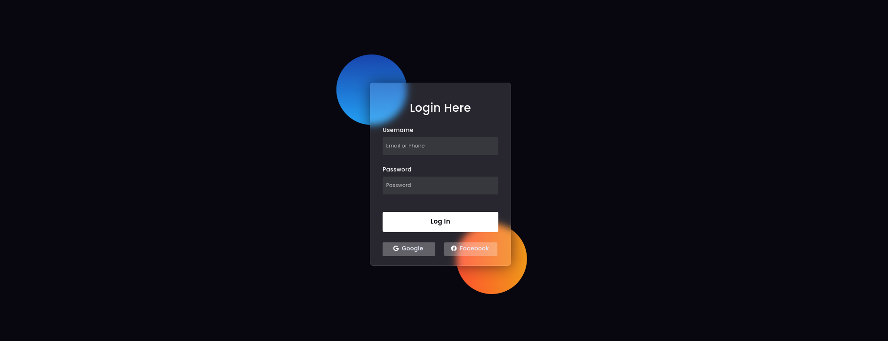

# Glass Form

This is a simple HTML and CSS form that covers the foundational concepts in **Phase0**.

## Technologies :hammer:

This app was created using:

- HTML
- CSS

## Screens :tv:

The page looks as follows:

